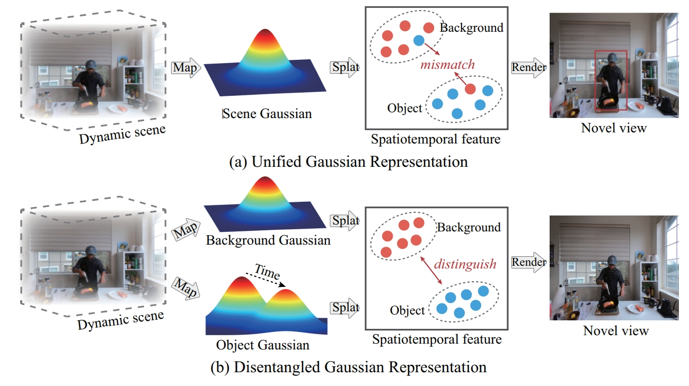
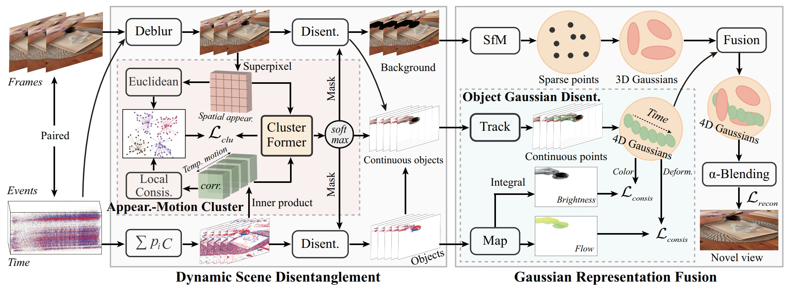

# STD-GS: Exploring Frame-Event Interaction for SpatioTemporal-Disentangled Gaussian Splatting to Reconstruct High-Dynamic Scene

## ICCV2025

[arXiv Paper](https://arxiv.org/abs/2506.23157)

[Hanyu Zhou](https://hyzhouboy.github.io/) $^{2*}$, [Haonan Wang](https://scholar.google.com.hk/citations?hl=zh-CN&view_op=list_works&gmla=AH8HC4wel7f5UzHZm3NN_RHl9by4ODKcg12HuynxhWBbyyFpY3GCQp_wRryBPNSci76ZfoOB8_IDasu-vEEyzy9skm3tDy0&user=LCNXgmAAAAAJ) $^{1*}$, [Haoyue Liu](https://scholar.google.com.hk/citations?hl=zh-CN&user=DadbHdAAAAAJ) $^1$, [Yuxing Duan](https://scholar.google.com.hk/citations?user=Hn5oJJsAAAAJ&hl=zh-CN) $1$, [Luxin Yan](https://scholar.google.com.hk/citations?user=5CS6T8AAAAAJ&hl=zh-CN) $^{1✉}$, [Gim Hee Lee](https://www.comp.nus.edu.sg/~leegh/) $^{2✉}$

$^1$ National Key Lab of Multispectral Information Intelligent Processing Technology

School of Artificial Intelligence and Automation, Huazhong University of Science and Technology

$^2$ School of Computing, National University of Singapore

$^*$ Equal Contributions.	$^✉$ Corresponding Author.





## News

2025.06.26: Our paper is accepted by ICCV 2025. The code will be coming soon.


## Citation

If you find this repository/work helpful in your research, welcome to cite this paper and give a ⭐.

```
@article{zhou2025std,
  title={STD-GS: Exploring Frame-Event Interaction for SpatioTemporal-Disentangled Gaussian Splatting to Reconstruct High-Dynamic Scene},
  author={Zhou, Hanyu and Wang, Haonan and Liu, Haoyue and Duan, Yuxing and Yan, Luxin and Lee, Gim Hee},
  journal={arXiv preprint arXiv:2506.23157},
  year={2025}
}
```

